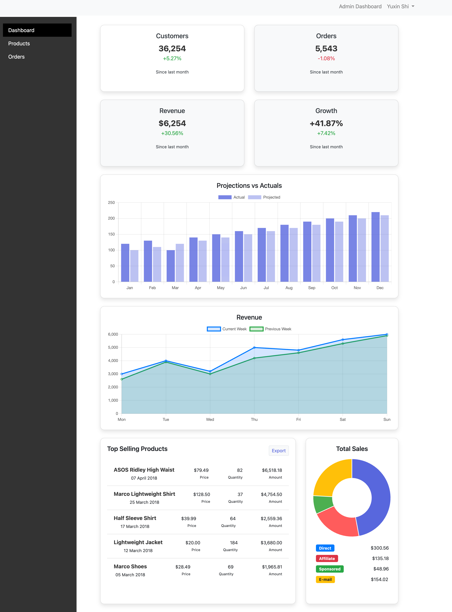
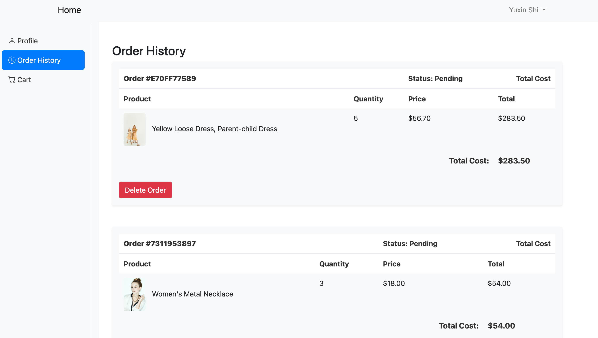
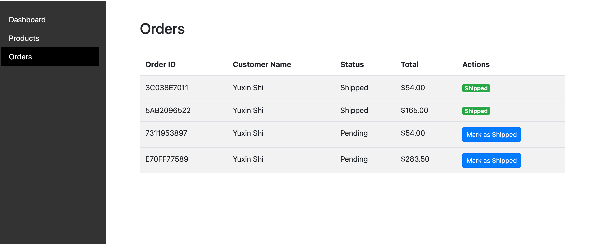
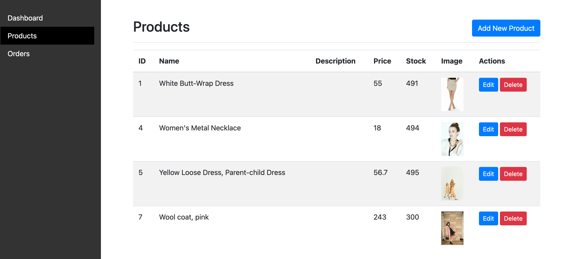

#### This project is a feature-rich e-commerce website built using the Laravel framework, tailored specifically for selling women’s clothing. It provides a seamless shopping experience for users, with functionalities optimized for both buyers and administrators.


To Run the Application:
```
php artisan serve
```
Screenshots of website:






